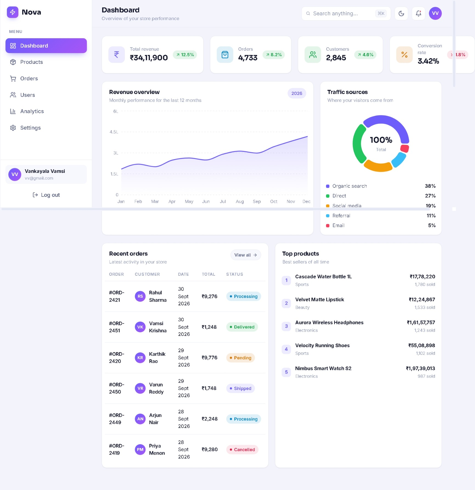
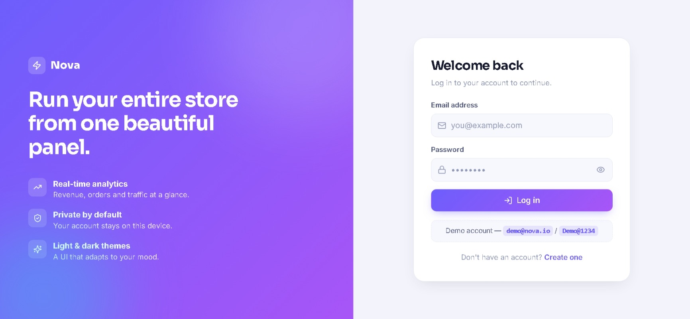
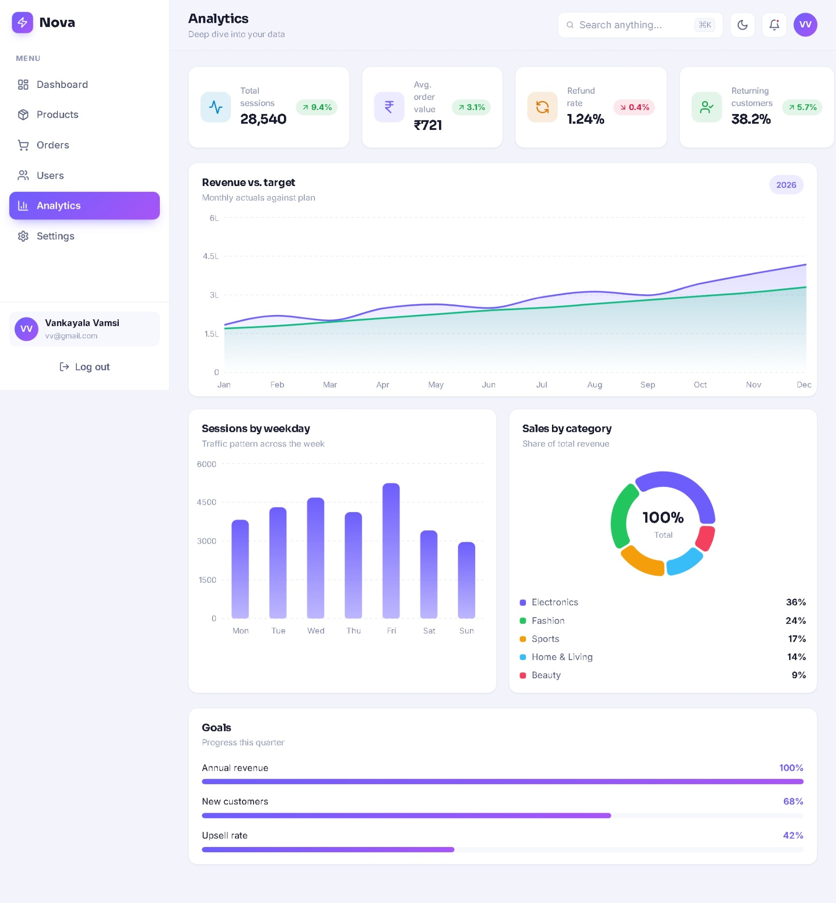

# ⚡ Nova Admin Dashboard

A modern, responsive **e-commerce administration dashboard** built with React and Vite. Nova brings store performance, orders, customers, products, and analytics into a clean dashboard experience with a focused purple-based visual system.

<p align="center">
  <a href="https://novadashboard23.netlify.app/">
    
  </a>
  <a href="https://github.com/vankayalavamsi/Nova-Admin-Dashboard">
    
  </a>
</p>

<p align="center">
  
</p>

---

## 🌐 Live Demo

**[Open Nova Admin Dashboard](https://novadashboard23.netlify.app/)**

> The application is deployed on Netlify and can be explored directly in the browser.

---

## 📌 Overview

**Nova Admin Dashboard** is designed as a centralized control panel for an e-commerce store.

The interface provides a quick view of important store metrics such as:

- Total revenue
- Orders
- Customers
- Conversion rate
- Revenue trends
- Traffic sources
- Recent orders
- Top-selling products
- Sessions
- Average order value
- Refund rate
- Returning customers
- Sales by category
- Business goals

The application also includes dedicated navigation for **Dashboard, Products, Orders, Users, Analytics, and Settings**.

---

## ✨ Features

### 📊 Dashboard

A high-level overview of store performance with:

- Revenue summary
- Order and customer metrics
- Conversion rate
- Monthly revenue visualization
- Traffic source breakdown
- Recent orders table
- Top products list
- Order status indicators

### 📈 Analytics

A deeper view of store performance including:

- Total sessions
- Average order value
- Refund rate
- Returning customer percentage
- Revenue vs. target chart
- Sessions by weekday
- Sales by category
- Goal progress indicators

### 🛍️ Product Management

A dedicated Products section is available from the main navigation for managing the store catalog.

### 📦 Order Management

The Orders section provides an admin-oriented view of store orders and their statuses.

### 👥 User Management

The Users section provides a dedicated area for customer/user administration.

### ⚙️ Settings

A separate Settings section is included for application configuration.

### 🔐 Authentication UI

Nova includes a dedicated login experience with:

- Email input
- Password input
- Password visibility control
- Demo account information
- Registration entry point

### 🌓 Interface Controls

The dashboard header includes controls for:

- Search
- Theme switching
- Notifications
- User profile

### 📱 Responsive UI

The layout is designed around a dashboard structure with a sidebar, top navigation, metric cards, charts, and data panels.

---

# 🖥️ Screenshots

## 🔐 Login

<p align="center">
  
</p>

The login screen introduces Nova with a focused authentication experience and highlights the dashboard's core capabilities.

---

## 📊 Dashboard

<p align="center">
  
</p>

The main dashboard provides an at-a-glance view of revenue, orders, customers, conversion rate, traffic sources, recent orders, and top products.

---

## 📈 Analytics

<p align="center">
  
</p>

The analytics page expands the dashboard into detailed performance visualizations, including revenue vs. target, weekday sessions, sales categories, and progress toward goals.

---

# 🛠️ Tech Stack

| Technology | Purpose |
| --- | --- |
| **React 18** | UI development |
| **Vite** | Development server and production build |
| **React Router DOM** | Client-side routing |
| **Recharts** | Charts and data visualization |
| **Lucide React** | Interface icons |
| **JavaScript / JSX** | Application development |
| **Netlify** | Deployment |

The repository currently defines React 18.3.1, React Router DOM 6.28.0, Recharts 2.13.3, Lucide React 0.454.0, and Vite 5.4.10 in `package.json`.

---

# 🚀 Getting Started

## Prerequisites

Make sure you have the following installed:

- **Node.js** 18+ recommended
- **npm**
- **Git**

You can verify your installation with:

```bash
node --version
npm --version
git --version
```

---

## 1. Clone the repository

```bash
git clone https://github.com/vankayalavamsi/Nova-Admin-Dashboard.git
```

## 2. Move into the project directory

```bash
cd Nova-Admin-Dashboard
```

## 3. Install dependencies

```bash
npm install
```

## 4. Start the development server

```bash
npm run dev
```

Vite will provide a local development URL in the terminal, typically:

```text
http://localhost:5173
```

---

# 📦 Production Build

Create an optimized production build:

```bash
npm run build
```

Preview the production build locally:

```bash
npm run preview
```

---

# 📜 Available Scripts

| Command | Description |
| --- | --- |
| `npm run dev` | Starts the Vite development server |
| `npm run build` | Creates the production build |
| `npm run preview` | Previews the production build locally |

---

# 🗂️ Project Structure

The repository is organized around a Vite + React application.

A simplified structure is:

```text
Nova-Admin-Dashboard/
│
├── public/
│   └── ...
│
├── src/
│   └── ...
│
├── screenshots/
│   ├── dashboard.png
│   ├── analytics.png
│   └── login.png
│
├── index.html
├── package.json
├── package-lock.json
├── vite.config.js
└── README.md
```

> The `screenshots/` directory above is for the README assets included with this documentation package. Add it to the repository if you want the screenshots to render directly on GitHub.

---

# 🎨 Design

Nova uses a clean admin-dashboard visual language built around:

- Purple primary actions
- Soft lavender page backgrounds
- Rounded cards
- Clear metric hierarchy
- Compact status badges
- Minimal iconography
- Data-focused charts
- Spacious dashboard layouts

The visual system is intended to keep information dense without making the interface feel crowded.

---

# 📊 Dashboard Modules

| Module | Purpose |
| --- | --- |
| **Dashboard** | Store performance overview |
| **Products** | Product/catalog administration |
| **Orders** | Order tracking and management |
| **Users** | User/customer administration |
| **Analytics** | Detailed business insights |
| **Settings** | Application configuration |

---

# 🔑 Demo Account

The login screen currently displays the following demo credentials:

```text
Email:    demo@nova.io
Password: Demo@1234
```

> If these credentials are changed in the application, update this section accordingly.

---

# 🌍 Deployment

Nova is currently deployed on **Netlify**.

### Live application

**https://novadashboard23.netlify.app/**

For a Vite deployment, the production build is generated with:

```bash
npm run build
```

The resulting `dist` directory can then be deployed through a supported static hosting provider.

---

# 🔧 Customization

You can extend Nova by adding:

- More dashboard widgets
- Additional analytics reports
- Product CRUD workflows
- Advanced order filtering
- User roles and permissions
- Backend/API integration
- Database persistence
- Exportable reports
- Real-time notifications
- Advanced search and filtering
- More responsive/mobile-specific layouts

The existing React + Vite setup provides a straightforward foundation for extending the dashboard.

---

# 🧭 Suggested Roadmap

Potential future improvements include:

- [ ] Connect the dashboard to a real backend API
- [ ] Add persistent authentication
- [ ] Add role-based access control
- [ ] Add product create/edit/delete workflows
- [ ] Add advanced order filters
- [ ] Add pagination and sorting
- [ ] Add CSV/Excel report exports
- [ ] Add server-side analytics
- [ ] Add automated tests
- [ ] Add improved mobile navigation
- [ ] Add CI/CD workflow
- [ ] Add accessibility testing

---

# 🤝 Contributing

Contributions and improvements are welcome.

### Fork the repository

```bash
git clone https://github.com/vankayalavamsi/Nova-Admin-Dashboard.git
cd Nova-Admin-Dashboard
npm install
```

Create a feature branch:

```bash
git checkout -b feature/your-feature-name
```

Make your changes, test them locally, and commit:

```bash
git add .
git commit -m "feat: add your feature"
```

Push the branch:

```bash
git push origin feature/your-feature-name
```

Then open a Pull Request on GitHub.

---

# 🐛 Issues & Feedback

If you find a bug or have an idea for improving Nova, open an issue in the repository:

**https://github.com/vankayalavamsi/Nova-Admin-Dashboard/issues**

When reporting a bug, include:

1. A clear description
2. Steps to reproduce it
3. Expected behavior
4. Actual behavior
5. Browser/device information
6. Screenshots or console errors when relevant

---

# 📄 License

No license file is currently shown in the repository. If you intend to distribute or reuse Nova publicly, add an appropriate `LICENSE` file and update this section.

---

# 👨‍💻 Author

**Vankayala Vamsi**

- GitHub: **https://github.com/vankayalavamsi**
- Project: **https://github.com/vankayalavamsi/Nova-Admin-Dashboard**
- Live Demo: **https://novadashboard23.netlify.app/**

---

## ⭐ Support

If you find Nova useful, consider giving the repository a star on GitHub.

<p align="center">
  Built with ⚡ React + Vite
</p>
